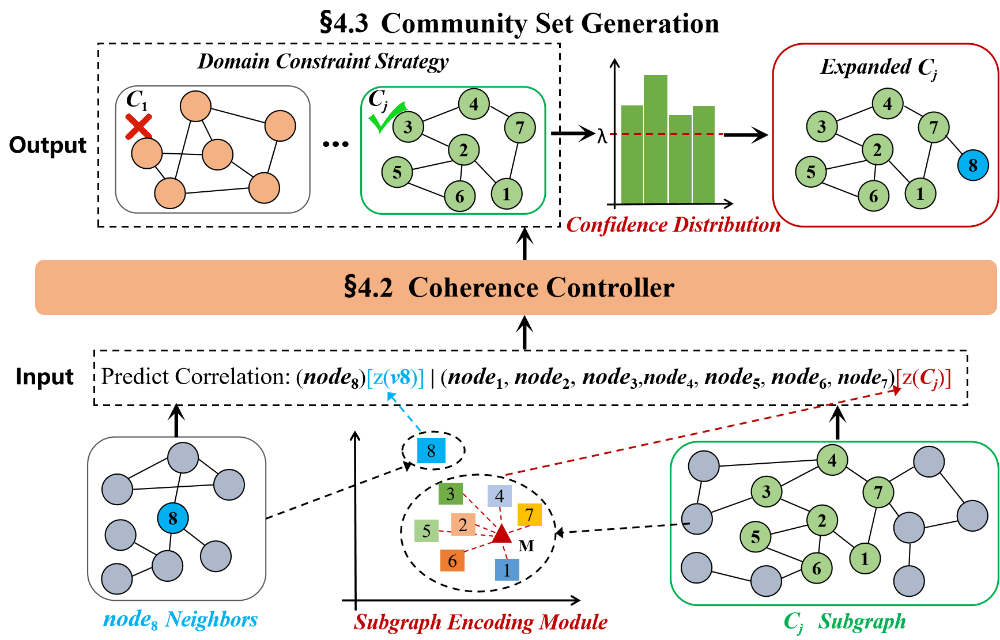

<h1 align="center">
  INSEP
</h1>

<h4 align="center">Generalizing Few-shot Graph Data Stream: Semi-supervised Generative Community Detection</h4>

<h2 align="center">
  Overview of SemiGCD
  
</h2>
This repository includes the source code of the paper accepted by xxxxxx. 

[//]: # ([**"INSEP: Iterative Evaluation Framework for Script Event Prediction".**]&#40;https://arxiv.org/abs/2209.07299&#41;)

### Dependencies

- Dependencies can be installed using `requirements.txt`.

### Dataset:

- We use Amazon, DBLP and Livejournal and finance dataset for CD task.
- 
### Pretrained Checkpoint:

The single datasets results are:

|   Dataset   |   F1   | Jaccard |  ONMI  | 
|:-----------:|:------:|:-------:|:------:|
|   Amazon    | 0.9014 | 0.8718  | 0.8746 | 
|    DBLP     | 0.5632 | 0.4396  | 0.3381 |
| Livejournal | 0.6792 | 0.5876  | 0.5407 |

The hybrid datasets results are:

|     Dataset      |   F1   | Jaccard |  ONMI  |
|:----------------:|:------:|:-------:|:------:|
|   Amazon*DBLP    | 0.5290 | 0.4021  | 0.3607 |
|   DBLP*Amazon    | 0.5211 | 0.3959  | 0.2813 |
| DBLP*Livejournal | 0.5057 | 0.3737  | 0.2545 |
| Livejournal*DBLP | 0.6832 | 0.5715  | 0.5310 |


### Training and testing:

- Install all the requirements from `./requirements.txt.`
- Commands for reproducing the reported results:
  ##### (1)  Evaluator
  python main.py 
- epoch=300
- lamda=20
- skip_n_val_epoch:train_model->1000; test_model->0


### Citation

If you used our work or found it helpful, please use the following citation:
```
@inproceedings{SemiGCD,
    title = "Generalizing Few-shot Graph Data Stream: Semi-supervised Generative Community Detection",
    author = "Li, Jinpeng and
      Yu, Hang  and
      Luo, Xiangfeng 
    booktitle = "xxxxxx",
}
```
